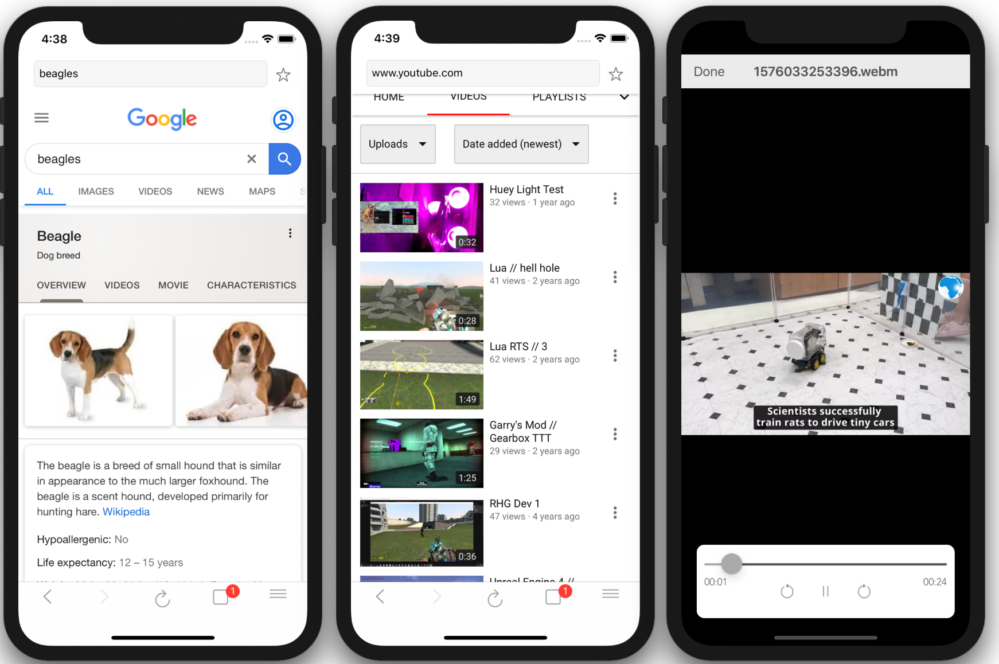

# Beagle Browser 

 **About**
Beagle Browser is an iOS browser that supports media content not natively supported by Safari or Chrome.

**Settings**
Developed on Xcode 11.1. iPhone X - 13.1

# TODO

 - [x]  Browse websites
 - [x] Search queries
 - [x] Media player
 - [x] View Webms
 - [ ] Settings page
 - [x] Web control buttons ( back, forward, refresh )
 - [ ] Coredata History
 - [ ] User defaults color customizaton
 - [ ] More video file support
 - [ ] Tabs support

**APIs**

This is made possible by VLCKit
[https://github.com/videolan/vlckit](https://github.com/videolan/vlckit)

**Credits**  
Joseph Storer, Gmremcorat@gmail.com - www.josephstorer.com   
videolan - [https://www.videolan.org/index.html](https://www.videolan.org/index.html)
